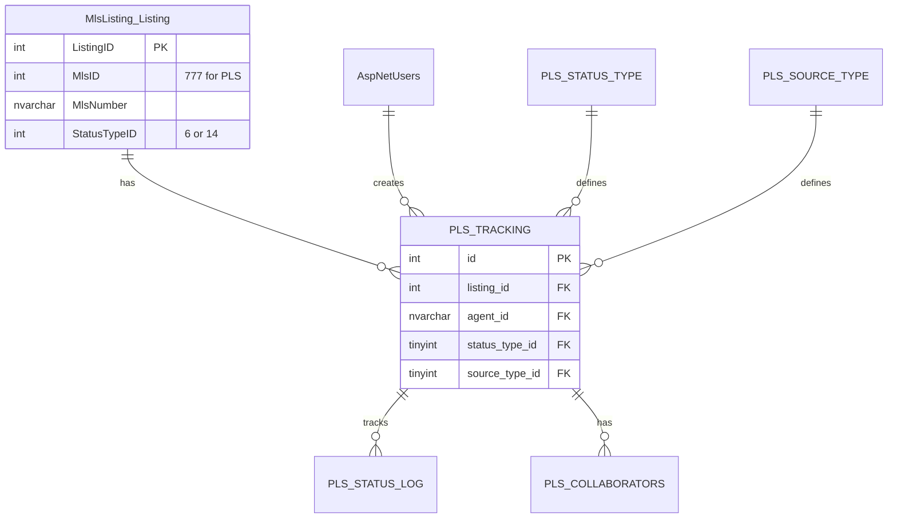

# PLS Platform Documentation Master
**Version:** 1.1  
**Created:** 01/13/2026 9:30 PM  
**Last Updated:** 01/13/2026 9:45 PM  
**Author:** JR (Project Manager)  
**Status:** ✅ ACTIVE - Complete Platform Reference for Development Team

---

## 🎯 PURPOSE

This document provides the development team with a **complete picture of the current platform** including:
- Visual schema diagrams with joins to current database
- Source code inventory
- Stored procedures catalog
- Roles and permissions framework
- Infrastructure components
- Legacy software constraints

**This is the SINGLE SOURCE OF TRUTH for platform understanding.**

**DRA-2026 Compliant:** ✅ Yes - Master document with cataloged exhibits  
**Master Rules Compliant:** ✅ Yes - Proper versioning, headers, change log

---

## 📊 1. VISUAL SCHEMA DIAGRAMS

### 1.1 Available Tools & Formats

#### Option 1: Markdown Text Diagrams (Current)
**Location:** `06_Infrastructure/PLS_SCHEMA_VISUAL_DIAGRAM_NORMALIZED_v3.md`

**Pros:**
- ✅ Already created and maintained
- ✅ Version controlled in Git
- ✅ Easy to update
- ✅ Shows all relationships clearly

**Cons:**
- ❌ Not interactive
- ❌ Limited visual appeal

#### Option 2: Mermaid Diagrams (Recommended)
**Tool:** Mermaid.js - Markdown-compatible diagram syntax

**Pros:**
- ✅ Renders in GitHub, VS Code, and most markdown viewers
- ✅ Interactive in some viewers
- ✅ Easy to maintain (text-based)
- ✅ Can be exported to PNG/SVG
- ✅ Free and open source

**Implementation:**

#### Option 3: Draw.io / diagrams.net (Professional)
**Tool:** [diagrams.net](https://app.diagrams.net/) (formerly draw.io)

**Pros:**
- ✅ Professional Visio-like interface
- ✅ Free and open source
- ✅ Exports to PNG, SVG, PDF, Visio format
- ✅ Can be stored in Git (XML format)
- ✅ Collaborative editing
- ✅ Extensive shape libraries

**Implementation:**
- Create `.drawio` files in `06_Infrastructure/Diagrams/`
- Export to PNG/SVG for documentation
- Store source `.drawio` files in Git

#### Option 4: SQL Server Management Studio (SSMS) Database Diagrams
**Tool:** Built into SSMS

**Pros:**
- ✅ Native SQL Server tool
- ✅ Auto-generates from actual database
- ✅ Shows actual relationships
- ✅ Can export to image

**Cons:**
- ❌ Requires database access
- ❌ Not version controlled easily

#### Option 5: dbdiagram.io (Online)
**Tool:** [dbdiagram.io](https://dbdiagram.io/)

**Pros:**
- ✅ Free tier available
- ✅ Beautiful visualizations
- ✅ Exports to PNG, PDF, Postgres, MySQL
- ✅ Shareable links
- ✅ Version history

**Cons:**
- ❌ Online service (requires account)
- ❌ Limited free tier

### 1.2 Recommended Approach

**Primary:** Mermaid diagrams in markdown files (for version control and easy updates)  
**Secondary:** Draw.io diagrams for complex visualizations (exported to PNG/SVG)

**Action Items:**
1. ✅ Create Mermaid ER diagram showing PLS tables + existing database joins
2. ✅ Create Draw.io diagram for complete system architecture
3. ✅ Export diagrams to PNG/SVG for documentation
4. ✅ Store source files in `06_Infrastructure/Diagrams/`

---

## 📄 2. eRealtor v1 PDF DOCUMENTATION SPECIFICATION

### 2.1 eRealtor Reference Found

**Location:** `D:\Cursor\TheGenie.ai\Development\MLS_Parsers\eRealtorMSv1i1 Tech Design.pdf`  
**Extracted Text:** `D:\Cursor\TheGenie.ai\Development\MLS_Parsers\eRealtor_Spec_Extracted_v1.txt`  
**Reference in Blueprint:** `PLS_RESO_ENGINE_PROJECT_BLUEPRINT_v1.7.md` Section 20.8

**eRealtor Tech Design v1.1.2 Structure (Dec 20, 2016):**

#### Document Sections (from PDF):
1. **STRATEGY 1:** Logical Components Diagram
2. **STRATEGY 2-3:** Deployment Package Contents (MSXML3, VB6 runtimes, SQL scripts, etc.)
3. **STRATEGY 4:** Deployment Configuration (WWW, Config)
4. **STRATEGY 5:** Coding Requirements
   - Option Explicit required
   - All include files documented
   - Best practices for COM porting
5. **STRATEGY 6:** Session Management (`isSessionManagement`)
   - 10-minute session lifespan (configurable)
   - Session data fields: UID, UserTypeCode, BrokerUserID, PL_BrokerID, PL_UserType, PL_Header, PL_Footer, Authenticated, Smart_Return
6. **STRATEGY 7:** Include Files Pattern
   - `_AuthCheck.inc` - Authentication verification
   - `_Constants.inc` - Never use "magic numbers"
   - `_PickLists.inc` - Picklist generation
   - `_SessionRead.inc` - Read session data
   - `_PL_Header.inc` - Private label header
   - `_PL_Footer.inc` - Private label footer
   - `_SessionSave.inc` - Save session data
   - `_vbs.inc` - VB enums and constants
7. **STRATEGY 8:** SOAP Interface Specifications
   - Request/response XML formats
   - No SDL file (time constraints)
8. **STRATEGY 9:** Private Label Header & Footer
   - Server-to-server communication (no cookies)
   - Cached for user session
   - Query string parameters: CID, UType
9. **STRATEGY 67:** Transaction Create Checklist Process
10. **STRATEGY 69:** Template Management

**Key Patterns from eRealtor:**
1. **Complete Technical Design Document** - Full system architecture with numbered strategies
2. **Database Schema Diagrams** - Visual representation of all tables
3. **API Specifications** - Complete SOAP interface documentation
4. **Session Management** - Detailed session state management
5. **Include Files Pattern** - Reusable code modules
6. **Private Label Support** - Header/footer customization
7. **Deployment Architecture** - Complete deployment package structure
8. **Coding Standards** - Option Explicit, documentation requirements

### 2.2 eRealtor Documentation Structure (Desired)

Based on **eRealtorMSv1i1 Tech Design.pdf** structure, our PLS Technical Design Document should follow this pattern:

#### Section 1: Executive Summary
- Project overview
- Business value
- Success criteria
- Version and date

#### Section 2: System Architecture (STRATEGY 1)
- **Logical Components Diagram** - Visual architecture
- Component relationships
- Technology stack
- Integration points

#### Section 3: Database Design
- **Complete schema diagram** (with joins to existing tables)
- Table definitions
- Relationship mappings
- Index strategy
- Data flow
- Stored procedures catalog

#### Section 4: API Specifications (STRATEGY 8)
- Complete endpoint documentation
- Request/response formats (REST/JSON for PLS, SOAP/XML for eRealtor)
- Authentication/authorization
- Error handling
- Interface contracts

#### Section 5: Session Management & State (STRATEGY 6)
- Session lifecycle (JWT tokens for PLS vs session cookies for eRealtor)
- State management
- Authentication flow
- Session data structure

#### Section 6: Code Organization (STRATEGY 7)
- **Service Layer Pattern** (equivalent to eRealtor's include files)
- Reusable components
- Constants management (lookup tables vs _Constants.inc)
- Best practices

#### Section 7: Roles & Permissions
- Role definitions
- Permission matrix
- Access control rules
- Security model

#### Section 8: Source Code Inventory
- Code structure
- Key classes/components
- Dependencies
- Patterns used

#### Section 9: Deployment Architecture (STRATEGY 2-3)
- Deployment package contents
- Server architecture
- Database servers
- Deployment process
- Configuration management
- Build procedures

#### Section 10: Integration Points
- External systems
- API contracts
- Data flows
- Dependencies
- Private label support (if applicable)

#### Section 11: Legacy Constraints
- Existing system limitations
- Compatibility requirements
- Migration considerations
- Breaking change risks

#### Section 12: Coding Standards (STRATEGY 5)
- Code requirements
- Documentation standards
- Version control
- Change management

### 2.3 eRealtor Patterns Applied to PLS

**eRealtor → PLS Mapping:**

| eRealtor Pattern | PLS Equivalent | Status |
|------------------|----------------|--------|
| **STRATEGY 6: Session Management** | JWT Bearer tokens | ✅ Implemented |
| **STRATEGY 7: Include Files** | Service layer (PlsService) | ⏳ To be created |
| **STRATEGY 7: _Constants.inc** | Lookup tables (pls_status_type, pls_source_type) | ✅ Implemented |
| **STRATEGY 6: isSessionManagement** | JWT token claims | ✅ Implemented |
| **STRATEGY 8: SOAP Interface** | REST API endpoints | ✅ Implemented |
| **STRATEGY 9: Private Label** | Not applicable (different architecture) | N/A |
| **STRATEGY 5: Coding Standards** | Master Rules compliance | ✅ Implemented |

**Key Differences:**
- **Technology:** PLS uses .NET Framework 4.8 Web API (modern), eRealtor used ASP/VB6 (legacy)
- **Authentication:** PLS uses JWT Bearer tokens, eRealtor used session cookies
- **Database:** PLS uses normalized schema with lookup tables, eRealtor used string enums
- **API:** PLS uses REST/JSON, eRealtor used SOAP/XML
- **Session:** PLS uses stateless JWT, eRealtor used stateful session management

### 2.4 Action Items

1. ✅ **Located eRealtorMSv1i1 Tech Design.pdf** - Found in `D:\Cursor\TheGenie.ai\Development\MLS_Parsers\`
2. ✅ **Extracted documentation structure** - Analyzed STRATEGY sections
3. ⏳ **Create PLS Technical Design Document** - Following eRealtor structure (12 sections)
4. ⏳ **Include all sections** - Complete platform documentation
5. ⏳ **Apply eRealtor patterns** - Session management, code organization, constants

---

## 🏗️ 3. COMPLETE PLATFORM PICTURE

### 3.1 Source Code Inventory

#### Backend API (C#)
**Location:** `08_Source_Code/`

| File | Purpose | Status |
|------|---------|--------|
| `PlsController_Complete_v1.cs` | Main API controller | ✅ Complete |
| `DataController_PLS_Complete_v1.cs` | Data controller partial class | ✅ Complete |
| `DataController_PLS_Implementation_v1.cs` | Implementation details | ✅ Complete |
| `DataController_Endpoints_v1.cs` | Endpoint definitions | ✅ Complete |

**Key Classes:**
- `PlsController` - REST API endpoints
- `DataController.PLS` - Data access layer
- `PlsService` - Business logic layer (to be created)

**Technology Stack:**
- .NET Framework 4.8
- ASP.NET Web API
- Entity Framework (if used)
- JWT Bearer authentication

#### Frontend (Angular)
**Location:** `08_Source_Code/`

| File | Purpose | Status |
|------|---------|--------|
| `pls-create.component.ts` | Create listing component | ✅ Active |
| `pls-create.component.html` | Component template | ✅ Active |
| `pls-create.component.scss` | Component styles | ✅ Active |

**Key Components:**
- `PlsMyListingsComponent` - List view (to be created)
- `PlsCreateComponent` - Create form (exists)
- `PlsEditComponent` - Edit form (to be created)
- `PlsPhotoUploadComponent` - Photo upload (to be created)

**Technology Stack:**
- Angular (version TBD)
- TypeScript
- RxJS
- Mapbox GL JS (address lookup)

### 3.2 Stored Procedures Catalog

**Location:** `02_Scripts/PLS_STORED_PROCEDURES_COMPLETE_v1.sql`

#### PLS-Specific Procedures

| Procedure | Purpose | Parameters | Returns |
|-----------|---------|------------|---------|
| `usp_GetNextPlsNumber` | Generate PLS number | None | `@PlsNumber NVARCHAR(10)` |
| `usp_GetPlsListing` | Get PLS listing with tracking | `@ListingId INT` | Listing + tracking data |
| `usp_CreatePlsListing` | Create new PLS listing | `@AgentId`, `@PropertyData` | `@ListingId INT` |
| `usp_UpdatePlsStatus` | Update listing status | `@ListingId`, `@NewStatus`, `@ChangedBy` | Success flag |
| `usp_GetPlsListingsByAgent` | Get agent's PLS listings | `@AgentId` | List of listings |

#### Existing Procedures (Referenced)

| Procedure | Database | Purpose | Used By PLS |
|-----------|----------|---------|------------|
| `usp_GetListing` | MlsListing | Get listing data | ✅ Yes |
| `usp_CreateListing` | MlsListing | Create listing | ✅ Yes |
| `usp_UpdateListing` | MlsListing | Update listing | ✅ Yes |

**Action Items:**
1. ⏳ **Complete stored procedure catalog** - Document all procedures
2. ⏳ **Add usage examples** - Show how to call each procedure
3. ⏳ **Document parameters** - Complete parameter documentation
4. ⏳ **Document return values** - Complete return value documentation

### 3.3 Roles & Permissions Framework

#### Current Role System
**Location:** `01_Master_Documents/PLS_MASTER_SPECIFICATION_v3.md` Section 3

**Roles:**
1. **Title Rep** - Can create PLS listings
2. **Agent** - Can create and manage own PLS listings
3. **Admin** - Full access to all PLS listings
4. **System** - System-level operations

#### Permission Matrix

| Permission | Title Rep | Agent | Admin | System |
|------------|-----------|-------|-------|--------|
| Create PLS Listing | ✅ | ✅ | ✅ | ✅ |
| Edit Own Listing | ✅ | ✅ | ✅ | ✅ |
| Edit Any Listing | ❌ | ❌ | ✅ | ✅ |
| Delete Own Listing | ✅ | ✅ | ✅ | ✅ |
| Delete Any Listing | ❌ | ❌ | ✅ | ✅ |
| View Own Listings | ✅ | ✅ | ✅ | ✅ |
| View All Listings | ❌ | ❌ | ✅ | ✅ |
| Generate XML | ✅ | ✅ | ✅ | ✅ |
| Trigger Render | ✅ | ✅ | ✅ | ✅ |

#### Database Tables
- `AspNetUsers` - User accounts
- `AspNetRoles` - Role definitions
- `AspNetUserRoles` - User-role assignments
- `PlsListingOwnership` - PLS-specific ownership tracking

**Action Items:**
1. ⏳ **Document complete permission matrix** - All permissions
2. ⏳ **Document role assignment process** - How roles are assigned
3. ⏳ **Document permission checks** - Where permissions are checked
4. ⏳ **Document security model** - Authentication/authorization flow

### 3.4 Infrastructure Components

#### Database Servers
- **FarmGenie Database:** `192.168.29.45,1433` or `server-mssql1.istrategy.com`
- **MlsListing Database:** Same server, different database
- **TitleData Database:** Same server, different database

#### Application Servers
- **Sandbox:** TBD
- **Stage:** TBD
- **Production:** TBD

#### External Services
- **GenieCloud:** Asset rendering service
- **Paisley AI:** Description generation (ChatStartTypeId=3)
- **TitleGenie:** Property data source
- **Mapbox:** Address lookup and mapping
- **S3:** Photo storage

#### Configuration Files
- `Web.config` - Application configuration
- `DLL.config` - **CRITICAL** - Connection strings loaded at startup
- Connection strings for all environments

**Action Items:**
1. ⏳ **Document server architecture** - Complete server inventory
2. ⏳ **Document connection strings** - All environments
3. ⏳ **Document deployment process** - Step-by-step
4. ⏳ **Document configuration management** - How configs are managed

### 3.5 Legacy Software Constraints

#### Existing System Limitations

**Database:**
- ✅ Uses existing `MlsListing.dbo.Listing` table (no schema changes)
- ✅ Must use `MlsId=777` for PLS listings
- ✅ Must use existing `StatusTypeID` values (6, 14)
- ⚠️ Cannot modify existing table structure
- ⚠️ Must maintain backward compatibility

**API:**
- ✅ Uses existing `DataController` pattern
- ✅ Must follow existing authentication/authorization
- ⚠️ Cannot break existing endpoints
- ⚠️ Must maintain API versioning

**Frontend:**
- ✅ Uses existing Angular application structure
- ✅ Must follow existing component patterns
- ⚠️ Cannot modify existing components
- ⚠️ Must maintain existing navigation

**Integration:**
- ✅ Must integrate with existing Listing Command workflow
- ✅ Must use existing GenieCloud XML format
- ⚠️ Cannot change existing integration contracts
- ⚠️ Must maintain existing data flows

#### Compatibility Requirements

**Technology Stack:**
- .NET Framework 4.8 (not .NET Core)
- SQL Server 2016+ (existing database version)
- Angular (existing version)
- Internet Explorer 11+ (if required)

**Breaking Changes:**
- ❌ Cannot modify existing `MlsListing.dbo.Listing` schema
- ❌ Cannot modify existing API endpoints
- ❌ Cannot modify existing authentication system
- ❌ Cannot modify existing role system

**Migration Considerations:**
- Must support existing data
- Must support existing users
- Must support existing workflows
- Must maintain data integrity

**Action Items:**
1. ⏳ **Document all legacy constraints** - Complete list
2. ⏳ **Document compatibility requirements** - Technology versions
3. ⏳ **Document breaking change risks** - What cannot be changed
4. ⏳ **Document migration considerations** - Data and user migration

---

## 📋 4. DOCUMENTATION DELIVERABLES

### 4.1 Visual Schema Diagrams

**Deliverable 1: Mermaid ER Diagram**
- File: `06_Infrastructure/Diagrams/PLS_SCHEMA_ER_DIAGRAM_v1.md`
- Shows: PLS tables + existing database joins
- Format: Mermaid syntax in markdown

**Deliverable 2: Draw.io Architecture Diagram**
- File: `06_Infrastructure/Diagrams/PLS_SYSTEM_ARCHITECTURE_v1.drawio`
- Export: `06_Infrastructure/Diagrams/PLS_SYSTEM_ARCHITECTURE_v1.png`
- Shows: Complete system architecture

**Deliverable 3: Database Relationship Diagram**
- File: `06_Infrastructure/Diagrams/PLS_DATABASE_RELATIONSHIPS_v1.drawio`
- Export: `06_Infrastructure/Diagrams/PLS_DATABASE_RELATIONSHIPS_v1.png`
- Shows: All table relationships with joins

### 4.2 Complete Platform Documentation

**Deliverable 4: PLS Technical Design Document**
- File: `01_Master_Documents/PLS_TECHNICAL_DESIGN_DOCUMENT_v1.md`
- Structure: Following eRealtorMSv1i1 Tech Design.pdf pattern
- Sections: All 12 sections (based on eRealtor STRATEGY sections)
- Reference: `D:\Cursor\TheGenie.ai\Development\MLS_Parsers\eRealtorMSv1i1 Tech Design.pdf`

**Deliverable 5: Source Code Inventory**
- File: `01_Master_Documents/PLS_SOURCE_CODE_INVENTORY_v1.md`
- Content: Complete code structure, classes, dependencies

**Deliverable 6: Stored Procedures Catalog**
- File: `01_Master_Documents/PLS_STORED_PROCEDURES_CATALOG_v1.md`
- Content: All procedures with parameters, returns, examples

**Deliverable 7: Roles & Permissions Guide**
- File: `01_Master_Documents/PLS_ROLES_PERMISSIONS_GUIDE_v1.md`
- Content: Complete permission matrix, role assignments, security model

**Deliverable 8: Infrastructure Guide**
- File: `01_Master_Documents/PLS_INFRASTRUCTURE_GUIDE_v1.md`
- Content: Server architecture, deployment, configuration

**Deliverable 9: Legacy Constraints Document**
- File: `01_Master_Documents/PLS_LEGACY_CONSTRAINTS_v1.md`
- Content: All constraints, compatibility requirements, migration considerations

---

## 🎯 5. IMPLEMENTATION PLAN

### Phase 1: Visual Diagrams (Week 1)
1. Create Mermaid ER diagram
2. Create Draw.io architecture diagram
3. Create database relationship diagram
4. Export all diagrams to PNG/SVG

### Phase 2: Platform Documentation (Week 2-3)
1. ✅ Located eRealtor PDF - `D:\Cursor\TheGenie.ai\Development\MLS_Parsers\eRealtorMSv1i1 Tech Design.pdf`
2. ⏳ Create Technical Design Document structure (12 sections based on eRealtor STRATEGY pattern)
3. ⏳ Complete Source Code Inventory
4. ⏳ Complete Stored Procedures Catalog
5. ⏳ Complete Roles & Permissions Guide
6. ⏳ Complete Infrastructure Guide
7. ⏳ Complete Legacy Constraints Document
8. ⏳ Apply eRealtor patterns (session management, code organization, constants)

### Phase 3: Review & Refinement (Week 4)
1. Review all documentation
2. Update diagrams as needed
3. Ensure completeness
4. Get team feedback

---

## 📚 6. EXHIBITS CATALOG

### Visual Diagrams
- `06_Infrastructure/PLS_SCHEMA_VISUAL_DIAGRAM_NORMALIZED_v3.md` - Current text diagram
- `06_Infrastructure/Diagrams/PLS_SCHEMA_ER_DIAGRAM_v1.md` - Mermaid ER diagram (to be created)
- `06_Infrastructure/Diagrams/PLS_SYSTEM_ARCHITECTURE_v1.drawio` - Draw.io architecture (to be created)
- `06_Infrastructure/Diagrams/PLS_DATABASE_RELATIONSHIPS_v1.drawio` - Draw.io relationships (to be created)

### Platform Documentation
- `01_Master_Documents/PLS_TECHNICAL_DESIGN_DOCUMENT_v1.md` - Technical design (to be created)
- `01_Master_Documents/PLS_SOURCE_CODE_INVENTORY_v1.md` - Source code inventory (to be created)
- `01_Master_Documents/PLS_STORED_PROCEDURES_CATALOG_v1.md` - Stored procedures (to be created)
- `01_Master_Documents/PLS_ROLES_PERMISSIONS_GUIDE_v1.md` - Roles & permissions (to be created)
- `01_Master_Documents/PLS_INFRASTRUCTURE_GUIDE_v1.md` - Infrastructure (to be created)
- `01_Master_Documents/PLS_LEGACY_CONSTRAINTS_v1.md` - Legacy constraints (to be created)

---

## 🔄 CHANGE LOG

| Version | Date/Time | Changes |
|:-------:|-----------|---------|
| 1.1 | 01/13/2026 9:45 PM | **eRealtor PDF Analysis:** Located and analyzed eRealtorMSv1i1 Tech Design.pdf from `D:\Cursor\TheGenie.ai\Development\MLS_Parsers\`. Extracted complete STRATEGY section structure (12 sections). Updated documentation structure to match eRealtor pattern. Added eRealtor → PLS pattern mapping. Updated Technical Design Document to 12 sections following eRealtor STRATEGY pattern. |
| 1.0 | 01/13/2026 9:30 PM | **INITIAL VERSION:** Created platform documentation master. Addressed all three user requirements: (1) Visual flowchart tools (Mermaid, Draw.io, SSMS, dbdiagram.io), (2) eRealtor documentation structure reference, (3) Complete platform picture (source code, stored procedures, roles, permissions, infrastructure, legacy constraints). Defined 9 documentation deliverables and implementation plan. |

---

**Status:** ✅ ACTIVE - Single Source of Truth for Platform Documentation

**Location:** `01_Master_Documents/PLS_PLATFORM_DOCUMENTATION_MASTER_v1.md`

**DRA-2026 Compliant:** ✅ Yes - Master document with cataloged exhibits
